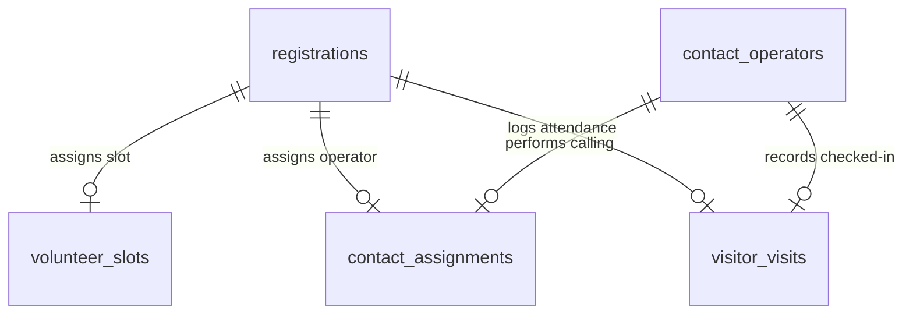

# Database Schema — Rathayatra Attendance & Assignment System

This document outlines the PostgreSQL database structure, index layout, triggers, constraints, custom RPC functions, and Row Level Security (RLS) policies configured on Supabase.

---

## 1. Tables & Relationships



### `registrations`
Holds volunteer and general attendee registration records. Main source of truth for the event.
- **`id`** (`uuid`, Primary Key): Default generated as `uuid_generate_v4()`.
- **`registration_no`** (`text`, Unique, Non-nullable): Automatically generated unique registration string in the format `REG-YYYY-000001` via triggers.
- **`full_name`** (`text`, Non-nullable): Registrant's full name.
- **`phone`** (`text`, Non-nullable): Contact number.
- **`age`** (`integer`, Non-nullable): Registrant's age.
- **`gender`** (`text`, Non-nullable): "Male" | "Female" | "Other".
- **`occupation`** (`text`): "Student" | "Working" | "Business" | "Other".
- **`company_college`** (`text`): School or workplace organization.
- **`area_of_stay`** (`text`): Local neighborhood/town.
- **`interested_to_volunteer`** (`boolean`, Default `false`): Volunteer flag.
- **`volunteer_slot_id`** (`uuid`, Foreign Key -> `volunteer_slots.id`): Selected service slot.
- **`wants_to_donate`** (`boolean`, Default `false`): Contribution interest.
- **`interested_to_dinner`** (`boolean`, Default `false`): Dinner prasadam RSVP flag.
- **`transportation_required`** (`text`): "Yes" | "No".
- **`pg_name`** (`text`): PG Accommodation Name (applicable if Male registrant).
- **`created_at`** (`timestamp with time zone`): Record timestamp.

### `volunteer_slots`
Maintains available slot timing groups for volunteer assignments.
- **`id`** (`uuid`, Primary Key).
- **`slot_time`** (`text`, Non-nullable, Unique): e.g. "9 AM - 1 PM".
- **`display_order`** (`integer`, Default `0`).

### `contact_operators`
Accounts for call operators assigned to dial registrants. Independent of Supabase native Auth.
- **`id`** (`uuid`, Primary Key).
- **`name`** (`text`, Non-nullable): Operator display name.
- **`email`** (`text`, Non-nullable, Unique): Login credential.
- **`phone`** (`text`): Operator contact number.
- **`password_hash`** (`text`, Non-nullable): Bcrypt hash of credential.
- **`is_active`** (`boolean`, Default `true`): Enabled/disabled status.
- **`max_contacts_capacity`** (`integer`, Default `50`): Maximum assigned contact slots.

### `contact_assignments`
Tracks registration calling statuses handled by operators.
- **`id`** (`uuid`, Primary Key).
- **`registration_id`** (`uuid`, Foreign Key -> `registrations.id`, Cascade Delete).
- **`operator_id`** (`uuid`, Foreign Key -> `contact_operators.id`, Cascade Delete).
- **`status`** (`text`, Default `'Pending'`): "Pending" | "Coming" | "Not Coming" | "Callback Required".
- **`remarks`** (`text`): Calling log notes.
- **`is_active`** (`boolean`, Default `true`): Active status flag.
- **`assigned_at`** (`timestamp with time zone`): Assignment timestamp.
- **`called_at`** (`timestamp with time zone`): Operator dial timestamp.

### `visitor_visits`
attendance check-in journal logging visitors upon arrival.
- **`id`** (`uuid`, Primary Key).
- **`registration_id`** (`uuid`, Foreign Key -> `registrations.id`, Cascade Delete, Unique): Ensures exactly one visit is recorded per registrant.
- **`visited_at`** (`timestamp with time zone`, Default `now()`): Arrival time.
- **`visit_method`** (`text`, Default `'MANUAL_SEARCH'`): Lookup method.
- **`visited_by`** (`uuid`, Foreign Key -> `contact_operators.id`): Operator facilitating check-in (nullable if admin).
- **`visited_by_admin`** (`boolean`, Default `false`): Checked in by dashboard administrator.
- **`remarks`** (`text`): Entry gate notes.

### `admins`
System administrator emails authorized to log in to the Dashboard.
- **`id`** (`uuid`, Primary Key -> `auth.users.id`): Bound to Supabase Auth.
- **`email`** (`text`, Non-nullable, Unique).

### `audit_logs`
Records core administrative and operations trails for security review.
- **`id`** (`uuid`, Primary Key).
- **`action`** (`text`, Non-nullable): e.g. "VISITOR_CHECK_IN", "BATCH_ASSIGNMENT".
- **`details`** (`jsonb`): JSON payload log.
- **`created_at`** (`timestamp with time zone`, Default `now()`).

---

## 2. Indexes & Unique Constraints

- **`visitor_visits_registration_id_key`**: Unique constraint on `visitor_visits.registration_id` to guarantee one check-in per registration.
- **`contact_assignments_reg_op_idx`**: Index on `contact_assignments(registration_id, operator_id)` to speed up assignment queries.
- **`registrations_registration_no_key`**: Unique constraint on `registrations.registration_no` to avoid duplicates.
- **`registrations_phone_idx`**: Index on `registrations(phone)` to accelerate caller lookups.

---

## 3. Database Functions & Triggers

### `assign_registration_no()`
Trigger function firing `BEFORE INSERT` on `registrations`. Generates formatting like `REG-2026-000012` using a dedicated Postgres sequence:
```sql
CREATE SEQUENCE registration_no_seq;
```

### `auto_assign_contacts()`
Runs batch load assignment logic (Admin RPC). Automatically allocates unassigned contacts to active operators up to their limits.

---

## 4. Row-Level Security (RLS)

- **`registrations`**: Read-only for authenticated operator roles; full permissions for system administrators.
- **`visitor_visits`**: RLS enabled. Allows insert permissions for operators and administrators.
